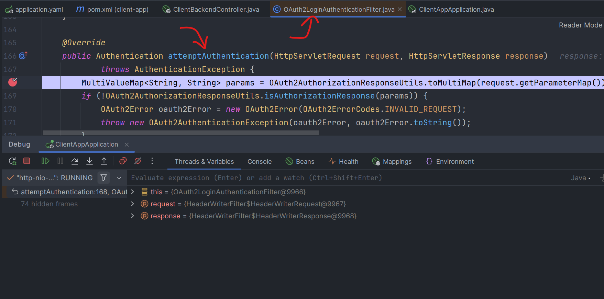
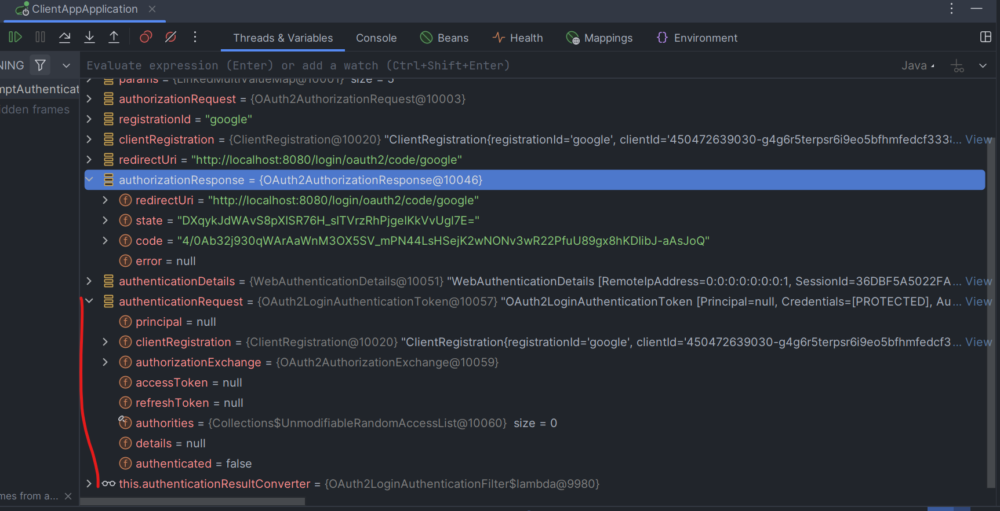
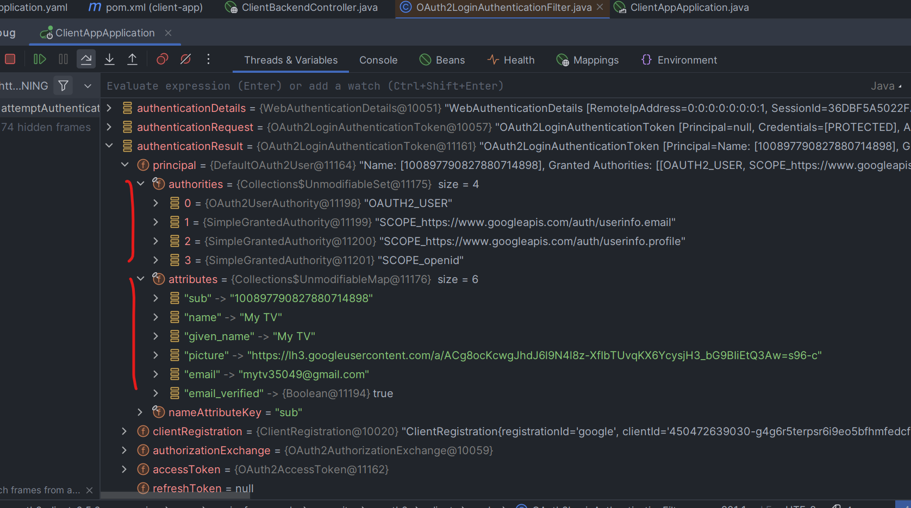
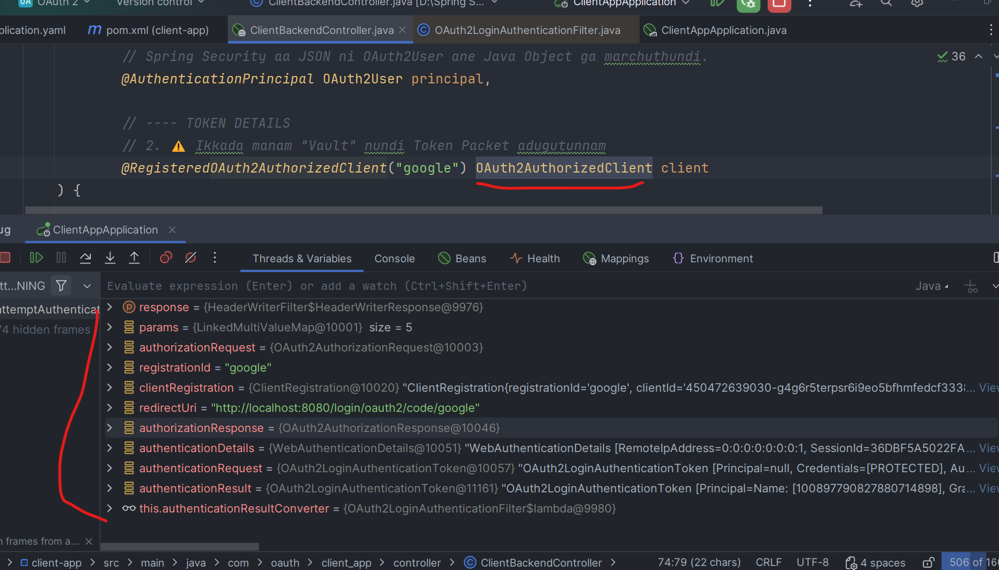
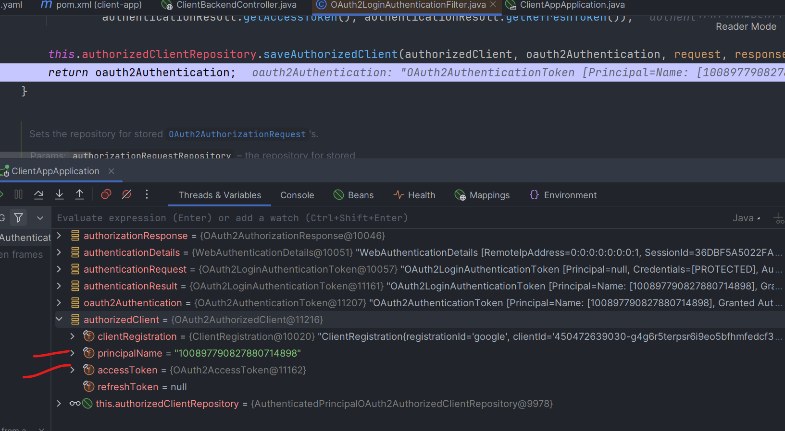

1. Step 1
When hitting the localhost:8080/

2. When Clicked on any account
It comes to OAuth2LoginAuthenticationFilter and attempts Authentication

3. We can see here carefully now we will get the code 

4. Now using the code we will get access token and profile directly from google

5. Also see the principal which we are getting

6. So we are getting ACCESS_TOKEN
and PRINCIPAL

7. Now see how we are getting these details in our controller

OAuth2AuthorizedClient

Right now see there is nothing here
(btw we already got the principal)

Now see here we are getting AuthorizedClient

