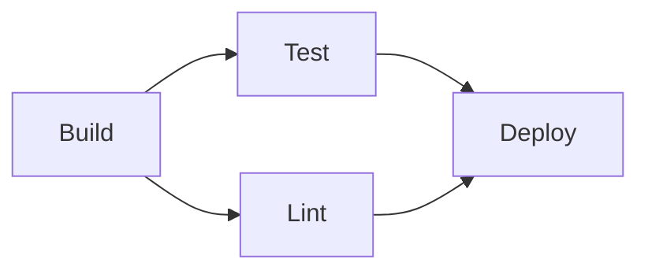
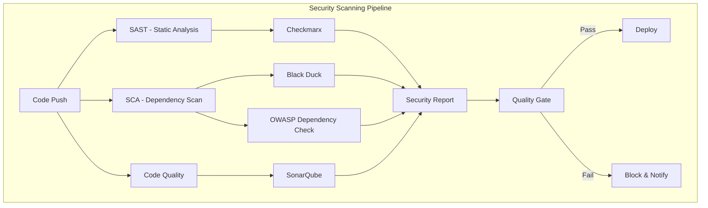

# 🚀 GitHub Actions: Basics to Mastery Roadmap (2025)

> **Goal**: Jenkins alternative ga complete CI/CD automation nerchukoni, real-world projects lo implement cheyyadaniki.

---

## 📋 Prerequisites

- [ ] Git basics (clone, push, pull, branches)
- [ ] YAML syntax basics
- [ ] Basic understanding of CI/CD concepts
- [ ] GitHub account (free tier - 2000 mins/month for private repos, **unlimited for public repos**)

---

## 🎯 Phase 1: Foundations (Week 1)

### 1.1 Core Concepts 🧠

| Concept | Description | Jenkins Equivalent |
|---------|-------------|-------------------|
| **Workflow** | Automated process defined in YAML | Pipeline/Jenkinsfile |
| **Job** | Set of steps running on same runner | Stage |
| **Step** | Individual task/command | Step |
| **Runner** | VM that executes jobs | Agent/Node |
| **Action** | Reusable unit of code | Plugin |
| **Event/Trigger** | What starts a workflow | Trigger |

### 1.2 Your First Workflow ✨

```yaml
# .github/workflows/hello-world.yml
name: Hello World

on:
  push:
    branches: [main]
  pull_request:
    branches: [main]

jobs:
  greet:
    runs-on: ubuntu-latest
    steps:
      - name: Say Hello
        run: echo "Hello, GitHub Actions! 🎉"
```

**Practice Tasks:**
- [ ] Create a public repo
- [ ] Add `.github/workflows/` directory
- [ ] Create `hello-world.yml`
- [ ] Push and see it run in Actions tab

### 1.3 Workflow Triggers (Events) 🎬

```yaml
on:
  # Code events
  push:
    branches: [main, develop]
    paths: ['src/**', '*.java']
  pull_request:
    types: [opened, synchronize, reopened]
  
  # Manual trigger
  workflow_dispatch:
    inputs:
      environment:
        description: 'Deployment environment'
        required: true
        default: 'staging'
        type: choice
        options: [dev, staging, prod]
  
  # Scheduled (cron)
  schedule:
    - cron: '0 0 * * *'  # Daily at midnight UTC
  
  # Other workflow completion
  workflow_run:
    workflows: ["Build"]
    types: [completed]
```

---

## 🔧 Phase 2: Intermediate (Week 2-3)

### 2.1 Working with Code 📦

```yaml
jobs:
  build:
    runs-on: ubuntu-latest
    steps:
      # Checkout code
      - uses: actions/checkout@v4
      
      # Setup Java (for Spring Boot)
      - name: Setup JDK 21
        uses: actions/setup-java@v4
        with:
          java-version: '21'
          distribution: 'temurin'
          cache: 'maven'
      
      # Build
      - name: Build with Maven
        run: mvn clean package -DskipTests
      
      # Run tests
      - name: Run Tests
        run: mvn test
```

### 2.2 Environment Variables & Secrets 🔐

```yaml
env:
  # Workflow-level env vars
  JAVA_VERSION: '21'
  APP_NAME: my-app

jobs:
  build:
    runs-on: ubuntu-latest
    env:
      # Job-level env vars
      BUILD_TYPE: release
    
    steps:
      - name: Use secret
        env:
          # Step-level (use for secrets!)
          DB_PASSWORD: ${{ secrets.DB_PASSWORD }}
          API_KEY: ${{ secrets.API_KEY }}
        run: |
          echo "Using secret safely"
          # NEVER echo secrets! They'll be masked
```

**Secrets Setup:**
1. Go to repo → Settings → Secrets and variables → Actions
2. Add Repository secrets
3. Reference using `${{ secrets.SECRET_NAME }}`

### 2.3 Artifacts - Sharing Data 📁

```yaml
jobs:
  build:
    runs-on: ubuntu-latest
    steps:
      - uses: actions/checkout@v4
      
      - name: Build
        run: mvn package
      
      # Upload artifact
      - name: Upload JAR
        uses: actions/upload-artifact@v4
        with:
          name: app-jar
          path: target/*.jar
          retention-days: 5

  deploy:
    needs: build
    runs-on: ubuntu-latest
    steps:
      # Download artifact
      - name: Download JAR
        uses: actions/download-artifact@v4
        with:
          name: app-jar
          path: ./artifacts
```

### 2.4 Caching Dependencies ⚡

```yaml
- name: Cache Maven dependencies
  uses: actions/cache@v4
  with:
    path: ~/.m2/repository
    key: ${{ runner.os }}-maven-${{ hashFiles('**/pom.xml') }}
    restore-keys: |
      ${{ runner.os }}-maven-
```

**Built-in caching (easier):**
```yaml
- uses: actions/setup-java@v4
  with:
    java-version: '21'
    distribution: 'temurin'
    cache: 'maven'  # Automatic caching!
```

### 2.5 Job Dependencies 🔗

```yaml
jobs:
  build:
    runs-on: ubuntu-latest
    steps:
      - run: echo "Building..."

  test:
    needs: build  # Waits for build
    runs-on: ubuntu-latest
    steps:
      - run: echo "Testing..."

  deploy:
    needs: [build, test]  # Waits for both
    runs-on: ubuntu-latest
    steps:
      - run: echo "Deploying..."
```



---

## 🚀 Phase 3: Advanced (Week 4-5)

### 3.1 Matrix Strategy 🔢

Run same job with different configurations:

```yaml
jobs:
  test:
    runs-on: ${{ matrix.os }}
    strategy:
      fail-fast: false  # Continue even if one fails
      max-parallel: 3   # Limit concurrent jobs
      matrix:
        os: [ubuntu-latest, windows-latest, macos-latest]
        java: [17, 21]
        exclude:
          - os: macos-latest
            java: 17
        include:
          - os: ubuntu-latest
            java: 21
            experimental: true
    
    steps:
      - uses: actions/checkout@v4
      - uses: actions/setup-java@v4
        with:
          java-version: ${{ matrix.java }}
          distribution: 'temurin'
      - run: java -version
```

### 3.2 Conditional Execution 🎭

```yaml
steps:
  - name: Run only on main
    if: github.ref == 'refs/heads/main'
    run: echo "This is main branch"
  
  - name: Run on PR only
    if: github.event_name == 'pull_request'
    run: echo "This is a PR"
  
  - name: Run even if previous failed
    if: always()
    run: echo "Cleanup..."
  
  - name: Run only on success
    if: success()
    run: echo "Previous steps succeeded"
  
  - name: Run only on failure
    if: failure()
    run: echo "Something failed!"
```

### 3.3 Environments & Approvals 🌍

```yaml
jobs:
  deploy-staging:
    runs-on: ubuntu-latest
    environment: staging  # Uses staging secrets
    steps:
      - run: echo "Deploying to staging..."

  deploy-production:
    needs: deploy-staging
    runs-on: ubuntu-latest
    environment: 
      name: production
      url: https://myapp.com
    steps:
      - run: echo "Deploying to production..."
```

**Setup Environments:**
1. Repo → Settings → Environments → New environment
2. Add protection rules (required reviewers)
3. Add environment-specific secrets

### 3.4 Reusable Workflows 🔄

**Create reusable workflow:** `.github/workflows/reusable-build.yml`
```yaml
name: Reusable Build

on:
  workflow_call:
    inputs:
      java-version:
        required: true
        type: string
    secrets:
      deploy-token:
        required: true

jobs:
  build:
    runs-on: ubuntu-latest
    steps:
      - uses: actions/checkout@v4
      - uses: actions/setup-java@v4
        with:
          java-version: ${{ inputs.java-version }}
          distribution: 'temurin'
      - run: mvn package
```

**Call reusable workflow:**
```yaml
name: CI

on: push

jobs:
  call-build:
    uses: ./.github/workflows/reusable-build.yml
    with:
      java-version: '21'
    secrets:
      deploy-token: ${{ secrets.DEPLOY_TOKEN }}
```

### 3.5 Composite Actions 🧩

Create your own action in `.github/actions/setup-java-maven/action.yml`:

```yaml
name: 'Setup Java & Maven'
description: 'Sets up Java and builds with Maven'

inputs:
  java-version:
    description: 'Java version'
    required: true
    default: '21'

runs:
  using: 'composite'
  steps:
    - uses: actions/setup-java@v4
      with:
        java-version: ${{ inputs.java-version }}
        distribution: 'temurin'
        cache: 'maven'
    
    - name: Build
      shell: bash
      run: mvn clean package -DskipTests
```

**Use it:**
```yaml
steps:
  - uses: actions/checkout@v4
  - uses: ./.github/actions/setup-java-maven
    with:
      java-version: '21'
```

---

## 🏆 Phase 4: Mastery (Week 6+)

### 4.1 Complete CI/CD Pipeline (Spring Boot Example)

```yaml
name: CI/CD Pipeline

on:
  push:
    branches: [main, develop]
  pull_request:
    branches: [main]

env:
  REGISTRY: ghcr.io
  IMAGE_NAME: ${{ github.repository }}

jobs:
  # ============ BUILD ============
  build:
    runs-on: ubuntu-latest
    outputs:
      version: ${{ steps.version.outputs.version }}
    
    steps:
      - uses: actions/checkout@v4
      
      - name: Setup JDK
        uses: actions/setup-java@v4
        with:
          java-version: '21'
          distribution: 'temurin'
          cache: 'maven'
      
      - name: Get version
        id: version
        run: echo "version=$(mvn help:evaluate -Dexpression=project.version -q -DforceStdout)" >> $GITHUB_OUTPUT
      
      - name: Build
        run: mvn clean package -DskipTests
      
      - name: Upload artifact
        uses: actions/upload-artifact@v4
        with:
          name: app-jar
          path: target/*.jar

  # ============ TEST ============
  test:
    needs: build
    runs-on: ubuntu-latest
    
    steps:
      - uses: actions/checkout@v4
      
      - uses: actions/setup-java@v4
        with:
          java-version: '21'
          distribution: 'temurin'
          cache: 'maven'
      
      - name: Run Unit Tests
        run: mvn test
      
      - name: Run Integration Tests
        run: mvn verify -DskipUnitTests

  # ============ CODE QUALITY ============
  quality:
    needs: build
    runs-on: ubuntu-latest
    
    steps:
      - uses: actions/checkout@v4
      
      - name: SonarQube Scan
        uses: sonarsource/sonarqube-scan-action@master
        env:
          SONAR_TOKEN: ${{ secrets.SONAR_TOKEN }}
          SONAR_HOST_URL: ${{ secrets.SONAR_HOST_URL }}

  # ============ SECURITY ============
  security:
    needs: build
    runs-on: ubuntu-latest
    
    steps:
      - uses: actions/checkout@v4
      
      - name: Run OWASP Dependency Check
        uses: dependency-check/Dependency-Check_Action@main
        with:
          project: 'MyApp'
          path: '.'
          format: 'HTML'

  # ============ DOCKER ============
  docker:
    needs: [test, quality]
    runs-on: ubuntu-latest
    if: github.ref == 'refs/heads/main'
    
    permissions:
      contents: read
      packages: write
    
    steps:
      - uses: actions/checkout@v4
      
      - name: Download artifact
        uses: actions/download-artifact@v4
        with:
          name: app-jar
          path: target
      
      - name: Login to GHCR
        uses: docker/login-action@v3
        with:
          registry: ${{ env.REGISTRY }}
          username: ${{ github.actor }}
          password: ${{ secrets.GITHUB_TOKEN }}
      
      - name: Build and push
        uses: docker/build-push-action@v5
        with:
          context: .
          push: true
          tags: |
            ${{ env.REGISTRY }}/${{ env.IMAGE_NAME }}:${{ needs.build.outputs.version }}
            ${{ env.REGISTRY }}/${{ env.IMAGE_NAME }}:latest

  # ============ DEPLOY STAGING ============
  deploy-staging:
    needs: docker
    runs-on: ubuntu-latest
    environment: staging
    
    steps:
      - name: Deploy to Staging
        run: |
          echo "Deploying to staging..."
          # kubectl apply, docker-compose, etc.

  # ============ DEPLOY PRODUCTION ============
  deploy-prod:
    needs: deploy-staging
    runs-on: ubuntu-latest
    environment: 
      name: production
      url: https://myapp.com
    
    steps:
      - name: Deploy to Production
        run: |
          echo "Deploying to production..."
```

### 4.2 GitHub Actions Best Practices ✅

| Category | Best Practice |
|----------|--------------|
| **Security** | Never hardcode secrets, use OIDC for cloud auth |
| **Performance** | Use caching, parallel jobs, matrix strategy |
| **Reliability** | Pin action versions (`@v4` not `@latest`), use timeouts |
| **Maintainability** | Use reusable workflows, composite actions |
| **Cost** | Use `cancel-in-progress` for PRs, optimize matrix |

### 4.3 2025 New Features 🆕

| Feature | Description |
|---------|-------------|
| **YAML Anchors** | Reduce duplication in complex workflows |
| **25 Workflow Inputs** | Up from 10, more parameterization |
| **10 Nested Reusable Workflows** | Deep workflow composition |
| **50 Total Workflow Calls** | Complex enterprise automation |
| **M2 macOS Runners** | GPU acceleration, faster iOS builds |
| **Larger Caches** | Faster builds for big projects |
| **OIDC Everywhere** | Secure cloud authentication |

---

## 🛡️ Phase 5: Enterprise Security Scanning (Java Projects)

> **Enterprise projects lo mandatory scans** - SonarQube, Checkmarx, Black Duck, OWASP, Trivy anni integrate cheyyadam nerchuko!

### 5.1 Security Scanning Overview 🔍



| Scan Type | Tool | Purpose |
|-----------|------|---------|
| **SAST** | Checkmarx | Source code vulnerabilities |
| **SCA** | Black Duck | Open source/license risks |
| **Dependency** | OWASP | Known CVE vulnerabilities |
| **Code Quality** | SonarQube | Bugs, smells, coverage |
| **Container** | Trivy | Docker image vulnerabilities |

---

### 5.2 SonarQube Integration 📊

**Code Quality + Security Hotspots + Technical Debt**

#### Option 1: SonarCloud (Free for Public Repos)

```yaml
name: SonarCloud Analysis

on:
  push:
    branches: [main, develop]
  pull_request:
    branches: [main]

jobs:
  sonarcloud:
    runs-on: ubuntu-latest
    
    steps:
      - uses: actions/checkout@v4
        with:
          fetch-depth: 0  # Full history for accurate blame
      
      - name: Setup JDK 21
        uses: actions/setup-java@v4
        with:
          java-version: '21'
          distribution: 'temurin'
          cache: 'maven'
      
      - name: Build & Test with Coverage
        run: mvn clean verify jacoco:report
      
      - name: SonarCloud Scan
        uses: SonarSource/sonarcloud-github-action@master
        env:
          GITHUB_TOKEN: ${{ secrets.GITHUB_TOKEN }}
          SONAR_TOKEN: ${{ secrets.SONAR_TOKEN }}
        with:
          args: >
            -Dsonar.projectKey=your-org_your-project
            -Dsonar.organization=your-org
            -Dsonar.java.binaries=target/classes
            -Dsonar.coverage.jacoco.xmlReportPaths=target/site/jacoco/jacoco.xml
```

#### Option 2: Self-Hosted SonarQube (Enterprise)

```yaml
name: SonarQube Analysis

on:
  push:
    branches: [main]

jobs:
  sonarqube:
    runs-on: ubuntu-latest
    
    steps:
      - uses: actions/checkout@v4
        with:
          fetch-depth: 0
      
      - name: Setup JDK
        uses: actions/setup-java@v4
        with:
          java-version: '21'
          distribution: 'temurin'
          cache: 'maven'
      
      - name: Build with Coverage
        run: mvn clean verify jacoco:report
      
      - name: SonarQube Scan
        uses: sonarsource/sonarqube-scan-action@master
        env:
          SONAR_TOKEN: ${{ secrets.SONAR_TOKEN }}
          SONAR_HOST_URL: ${{ secrets.SONAR_HOST_URL }}
      
      # Quality Gate Check - Fails if not passed
      - name: SonarQube Quality Gate
        uses: sonarsource/sonarqube-quality-gate-action@master
        timeout-minutes: 5
        env:
          SONAR_TOKEN: ${{ secrets.SONAR_TOKEN }}
```

**Required Secrets:**
| Secret | Description |
|--------|-------------|
| `SONAR_TOKEN` | Generate from SonarQube → My Account → Security |
| `SONAR_HOST_URL` | Your SonarQube server URL (self-hosted only) |

---

### 5.3 Checkmarx Integration (SAST) 🔐

**Static Application Security Testing - Source code vulnerabilities**

#### Checkmarx One (Latest)

```yaml
name: Checkmarx SAST Scan

on:
  push:
    branches: [main, develop]
  pull_request:
    branches: [main]

jobs:
  checkmarx-scan:
    runs-on: ubuntu-latest
    
    steps:
      - uses: actions/checkout@v4
      
      - name: Checkmarx One Scan
        uses: checkmarx/ast-github-action@main
        with:
          base_uri: ${{ secrets.CX_BASE_URI }}
          cx_client_id: ${{ secrets.CX_CLIENT_ID }}
          cx_client_secret: ${{ secrets.CX_CLIENT_SECRET }}
          cx_tenant: ${{ secrets.CX_TENANT }}
          additional_params: >
            --scan-types sast,sca
            --project-name ${{ github.repository }}
            --branch ${{ github.ref_name }}
      
      # Export to GitHub Security tab
      - name: Upload SARIF
        if: always()
        uses: github/codeql-action/upload-sarif@v3
        with:
          sarif_file: cx_result.sarif
```

#### Checkmarx CxFlow (Legacy)

```yaml
name: Checkmarx CxFlow Scan

on:
  pull_request:
    branches: [main]

jobs:
  checkmarx:
    runs-on: ubuntu-latest
    
    steps:
      - uses: actions/checkout@v4
      
      - name: Checkmarx Scan
        uses: checkmarx-ts/checkmarx-cxflow-github-action@v1.6
        with:
          project: ${{ github.repository }}
          team: '/CxServer/SP/Company'
          checkmarx_url: ${{ secrets.CHECKMARX_URL }}
          checkmarx_username: ${{ secrets.CHECKMARX_USERNAME }}
          checkmarx_password: ${{ secrets.CHECKMARX_PASSWORD }}
          checkmarx_client_secret: ${{ secrets.CHECKMARX_CLIENT_SECRET }}
          scanners: sast
          params: >
            --namespace=${{ github.repository_owner }}
            --repo-name=${{ github.event.repository.name }}
            --branch=${{ github.ref }}
            --cx-flow.filterSeverity --cx-flow.filterCategory
```

**Required Secrets:**
| Secret | Description |
|--------|-------------|
| `CX_BASE_URI` | Checkmarx One API URL |
| `CX_CLIENT_ID` | OAuth Client ID |
| `CX_CLIENT_SECRET` | OAuth Client Secret |
| `CX_TENANT` | Your Checkmarx tenant name |

---

### 5.4 Black Duck Integration (SCA) 🦆

**Software Composition Analysis - Open source vulnerabilities & license compliance**

```yaml
name: Black Duck SCA Scan

on:
  push:
    branches: [main]
  pull_request:
    branches: [main]

jobs:
  blackduck-scan:
    runs-on: ubuntu-latest
    
    steps:
      - uses: actions/checkout@v4
      
      - name: Setup JDK
        uses: actions/setup-java@v4
        with:
          java-version: '21'
          distribution: 'temurin'
          cache: 'maven'
      
      - name: Build Project
        run: mvn clean package -DskipTests
      
      - name: Black Duck Security Scan
        uses: synopsys-sig/synopsys-action@v1.9.0
        with:
          blackduck_url: ${{ secrets.BLACKDUCK_URL }}
          blackduck_token: ${{ secrets.BLACKDUCK_API_TOKEN }}
          blackduck_scan_full: true
          blackduck_scan_failure_severities: 'BLOCKER,CRITICAL'
        env:
          DETECT_PROJECT_NAME: ${{ github.repository }}
          DETECT_PROJECT_VERSION_NAME: ${{ github.ref_name }}
      
      # Upload results to GitHub Security
      - name: Upload SARIF
        if: always()
        uses: github/codeql-action/upload-sarif@v3
        with:
          sarif_file: blackduck-sarif.json
```

#### Alternative: Manual Synopsys Detect

```yaml
- name: Run Synopsys Detect
  run: |
    curl -LOk https://detect.synopsys.com/detect9.sh
    chmod +x detect9.sh
    ./detect9.sh \
      --blackduck.url=${{ secrets.BLACKDUCK_URL }} \
      --blackduck.api.token=${{ secrets.BLACKDUCK_API_TOKEN }} \
      --detect.project.name="${{ github.repository }}" \
      --detect.project.version.name="${{ github.ref_name }}" \
      --detect.policy.check.fail.on.severities=CRITICAL,BLOCKER
```

**Required Secrets:**
| Secret | Description |
|--------|-------------|
| `BLACKDUCK_URL` | Your Black Duck server URL |
| `BLACKDUCK_API_TOKEN` | API token from Black Duck → User Settings |

---

### 5.5 OWASP Dependency Check 🛡️

**Free alternative - Checks dependencies against known CVEs**

```yaml
name: OWASP Dependency Check

on:
  push:
    branches: [main]
  pull_request:
    branches: [main]
  schedule:
    - cron: '0 0 * * 0'  # Weekly scan

jobs:
  dependency-check:
    runs-on: ubuntu-latest
    
    steps:
      - uses: actions/checkout@v4
      
      - name: Setup JDK
        uses: actions/setup-java@v4
        with:
          java-version: '21'
          distribution: 'temurin'
          cache: 'maven'
      
      - name: Build Project
        run: mvn clean package -DskipTests
      
      - name: OWASP Dependency Check
        uses: dependency-check/Dependency-Check_Action@main
        id: depcheck
        with:
          project: '${{ github.repository }}'
          path: '.'
          format: 'HTML,SARIF'
          args: >
            --failOnCVSS 7
            --enableRetired
      
      - name: Upload Report
        uses: actions/upload-artifact@v4
        with:
          name: dependency-check-report
          path: ${{ github.workspace }}/reports
      
      # Show in GitHub Security tab
      - name: Upload SARIF
        if: always()
        uses: github/codeql-action/upload-sarif@v3
        with:
          sarif_file: ${{ github.workspace }}/reports/dependency-check-report.sarif
```

#### Using Maven Plugin (Alternative)

```yaml
- name: OWASP Check via Maven
  run: |
    mvn org.owasp:dependency-check-maven:check \
      -DfailBuildOnCVSS=7 \
      -Dformat=ALL
```

---

### 5.6 Trivy Container Scanning 🐳

**Scan Docker images for vulnerabilities**

```yaml
name: Container Security Scan

on:
  push:
    branches: [main]

jobs:
  trivy-scan:
    runs-on: ubuntu-latest
    
    steps:
      - uses: actions/checkout@v4
      
      - name: Build Docker Image
        run: docker build -t myapp:${{ github.sha }} .
      
      - name: Trivy Vulnerability Scan
        uses: aquasecurity/trivy-action@master
        with:
          image-ref: 'myapp:${{ github.sha }}'
          format: 'sarif'
          output: 'trivy-results.sarif'
          severity: 'CRITICAL,HIGH'
          exit-code: '1'  # Fail on vulnerabilities
      
      - name: Upload Trivy SARIF
        if: always()
        uses: github/codeql-action/upload-sarif@v3
        with:
          sarif_file: 'trivy-results.sarif'
      
      # Also scan filesystem/IaC
      - name: Trivy FS Scan
        uses: aquasecurity/trivy-action@master
        with:
          scan-type: 'fs'
          scan-ref: '.'
          format: 'table'
          severity: 'CRITICAL,HIGH'
```

---

### 5.7 Complete Enterprise Security Pipeline 🏢

```yaml
name: Enterprise Security Pipeline

on:
  push:
    branches: [main]
  pull_request:
    branches: [main]

jobs:
  # ========== BUILD ==========
  build:
    runs-on: ubuntu-latest
    steps:
      - uses: actions/checkout@v4
      - uses: actions/setup-java@v4
        with:
          java-version: '21'
          distribution: 'temurin'
          cache: 'maven'
      - run: mvn clean package -DskipTests
      - uses: actions/upload-artifact@v4
        with:
          name: build-artifacts
          path: target/*.jar

  # ========== SONARQUBE (Code Quality) ==========
  sonarqube:
    needs: build
    runs-on: ubuntu-latest
    steps:
      - uses: actions/checkout@v4
        with:
          fetch-depth: 0
      - uses: actions/setup-java@v4
        with:
          java-version: '21'
          distribution: 'temurin'
          cache: 'maven'
      - run: mvn clean verify jacoco:report
      - uses: sonarsource/sonarqube-scan-action@master
        env:
          SONAR_TOKEN: ${{ secrets.SONAR_TOKEN }}
          SONAR_HOST_URL: ${{ secrets.SONAR_HOST_URL }}
      - uses: sonarsource/sonarqube-quality-gate-action@master
        timeout-minutes: 5
        env:
          SONAR_TOKEN: ${{ secrets.SONAR_TOKEN }}

  # ========== CHECKMARX (SAST) ==========
  checkmarx:
    needs: build
    runs-on: ubuntu-latest
    steps:
      - uses: actions/checkout@v4
      - uses: checkmarx/ast-github-action@main
        with:
          base_uri: ${{ secrets.CX_BASE_URI }}
          cx_client_id: ${{ secrets.CX_CLIENT_ID }}
          cx_client_secret: ${{ secrets.CX_CLIENT_SECRET }}
          cx_tenant: ${{ secrets.CX_TENANT }}
          additional_params: --scan-types sast

  # ========== BLACK DUCK (SCA) ==========
  blackduck:
    needs: build
    runs-on: ubuntu-latest
    steps:
      - uses: actions/checkout@v4
      - uses: actions/setup-java@v4
        with:
          java-version: '21'
          distribution: 'temurin'
          cache: 'maven'
      - run: mvn package -DskipTests
      - uses: synopsys-sig/synopsys-action@v1.9.0
        with:
          blackduck_url: ${{ secrets.BLACKDUCK_URL }}
          blackduck_token: ${{ secrets.BLACKDUCK_API_TOKEN }}
          blackduck_scan_full: true

  # ========== OWASP (Free Alternative) ==========
  owasp:
    needs: build
    runs-on: ubuntu-latest
    steps:
      - uses: actions/checkout@v4
      - uses: dependency-check/Dependency-Check_Action@main
        with:
          project: '${{ github.repository }}'
          path: '.'
          format: 'SARIF'
          args: --failOnCVSS 8
      - uses: github/codeql-action/upload-sarif@v3
        if: always()
        with:
          sarif_file: reports/dependency-check-report.sarif

  # ========== SECURITY GATE ==========
  security-gate:
    needs: [sonarqube, checkmarx, blackduck, owasp]
    runs-on: ubuntu-latest
    steps:
      - name: All Security Checks Passed
        run: echo "✅ All security scans passed!"

  # ========== DEPLOY (Only after security gate) ==========
  deploy:
    needs: security-gate
    runs-on: ubuntu-latest
    environment: production
    if: github.ref == 'refs/heads/main'
    steps:
      - name: Deploy to Production
        run: echo "Deploying secure application..."
```

---

### 5.8 Security Scanning Best Practices ✅

| Practice | Description |
|----------|-------------|
| **Shift Left** | Scan early in CI, not just before production |
| **Quality Gates** | Block deployments on critical vulnerabilities |
| **SARIF Integration** | Use GitHub Security tab for unified view |
| **Regular Scans** | Schedule weekly full scans (dependencies update) |
| **Secret Rotation** | Rotate API tokens every 90 days |
| **Fail Fast** | Stop pipeline on CRITICAL/BLOCKER issues |
| **Baseline** | Establish acceptable risk baseline, fix incrementally |
| **OIDC Auth** | Use OIDC instead of long-lived tokens where possible |

---

### 5.9 Free vs Paid Tools Comparison 💰

| Tool | Free Tier | Enterprise |
|------|-----------|------------|
| **SonarCloud** | ✅ Public repos | Paid for private |
| **SonarQube** | ✅ Community Edition | Enterprise Edition |
| **Checkmarx** | ❌ | Paid only |
| **Black Duck** | ❌ | Paid only |
| **OWASP DC** | ✅ Fully free | N/A |
| **Trivy** | ✅ Fully free | N/A |
| **GitHub CodeQL** | ✅ Public repos | GitHub Enterprise |
| **Snyk** | ✅ Limited free | Paid for teams |

> 💡 **Mawa Tip**: Learning ki OWASP + Trivy + SonarCloud use chey - **100% free**! Enterprise job lo Checkmarx/Black Duck vadtharu, but concepts same untai.

---

## 📊 Learning Milestones Checklist

### 🥉 Beginner (Done when you can...)
- [ ] Create basic workflow with push trigger
- [ ] Use `actions/checkout` and `actions/setup-*`
- [ ] Understand workflow YAML structure
- [ ] Read and debug workflow logs

### 🥈 Intermediate (Done when you can...)
- [ ] Use secrets and environment variables
- [ ] Implement caching for faster builds
- [ ] Upload/download artifacts between jobs
- [ ] Use job dependencies with `needs`
- [ ] Write conditional steps with `if`

### 🥇 Advanced (Done when you can...)
- [ ] Design matrix strategies for multi-platform testing
- [ ] Create reusable workflows
- [ ] Build composite actions
- [ ] Implement environment approvals
- [ ] Set up complete CI/CD for containerized apps

### 🏆 Master (Done when you can...)
- [ ] Design enterprise-grade multi-repo workflows
- [ ] Implement GitOps with GitHub Actions
- [ ] Create self-hosted runners
- [ ] Optimize for cost and performance
- [ ] Implement security scanning and compliance

---

## 🔗 Resources

| Resource | Link |
|----------|------|
| Official Docs | [docs.github.com/actions](https://docs.github.com/en/actions) |
| Marketplace | [github.com/marketplace](https://github.com/marketplace?type=actions) |
| Starter Workflows | [github.com/actions/starter-workflows](https://github.com/actions/starter-workflows) |
| Action Examples | [github.com/actions](https://github.com/actions) |

---

## 🎯 Practice Project Ideas

1. **Basic**: Hello World + Java version print
2. **Intermediate**: Spring Boot app with tests + artifact upload
3. **Advanced**: Multi-module Maven + Docker build + GHCR push
4. **Master**: Complete CI/CD with staging/prod environments + Kubernetes deploy
l
---

> 💡 **Mawa Tip**: Start with public repo - **unlimited free minutes**! Nee OAuth 2 project ki GitHub Actions setup cheddam, real learning avthundi!

**Happy Learning! 🚀**
l